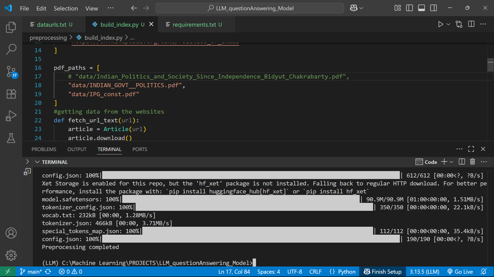

# 🧠 RAG-Based Question Answering System

This project is a **Retrieval-Augmented Generation (RAG)** based Question Answering (QA) system that answers questions using content retrieved from **PDFs and websites**. It uses a vector search (FAISS) over embedded document chunks and a transformer QA model to generate precise answers.

---

## 📸 System Overview

### 🧩 Architecture


### 💻 UI Demo


---

## 📁 Project Structure

```
├── app/
│   ├── rag_main.py          # Core RAG pipeline logic
│   └── ui_streamlit.py      # Streamlit interface
├── artifacts/
│   ├── rag_chunks.json      # JSON containing document chunks
│   ├── rag_index.faiss      # FAISS vector index
│   └── rag_embedder/        # SentenceTransformer model directory
├── data/
│   ├── book1.pdf          # pdf to feed the model
│   └── book2.pdf      
├── image/
│   ├── example.png          # Architecture diagram
│   └── working.png          # UI demo image
├── requirements.txt         # Python dependencies
├── dataurls.txt             # Website URLs used for scraping
└── README.md
```

## 🛠 Built With

- **[SentenceTransformers](https://www.sbert.net/)** – for text embeddings  
- **[FAISS](https://github.com/facebookresearch/faiss)** – for efficient vector similarity search  
- **[HuggingFace Transformers](https://huggingface.co/transformers/)** – for the QA model (e.g., `deepset/roberta-base-squad2`)  
- **[Streamlit](https://streamlit.io/)** – for building the interactive UI

## 👤 Author

**Sourav Sharma**  
📧 [souravbgp2210@gmail.com](souravbgp2210@gmail.com)  
🔗 [GitHub](https://github.com/souravsharma22)
